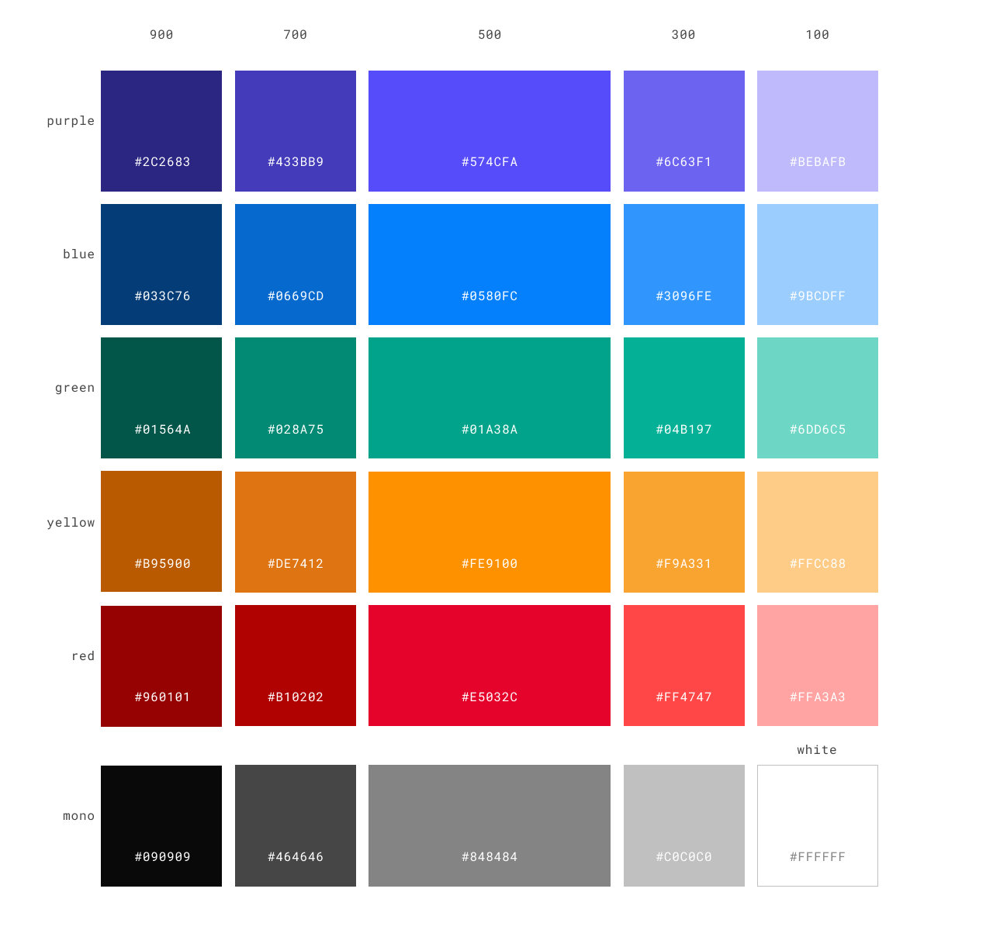

# Design library 

This repository helps standardize way designs are implemented across liberate science projects. This makes it easier to propagate any changes to the design system, by simply updating this library.

## Usage

```sh
npm install @libscie/design-library
```

```js
const libscie = require('@libscie/design-library')
// If you want to import only specific parts of the design library
const {
    colors
} = require('@libscie/design-library')
```

## Colors

```js
const background = libscie.colors.purple900
const alternatively = colors.purple900
```



The name is the base color; the number indicates the XXX. The only exception is `white`, which replaces `mono100`.